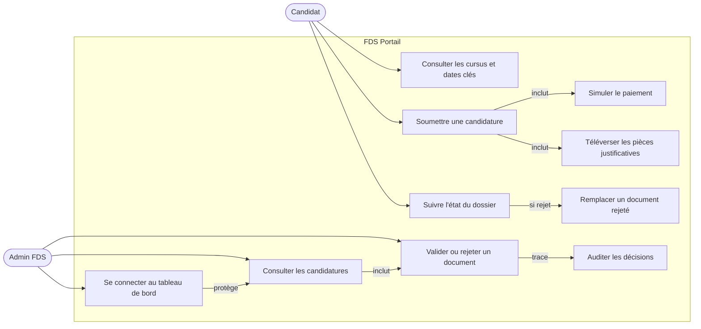
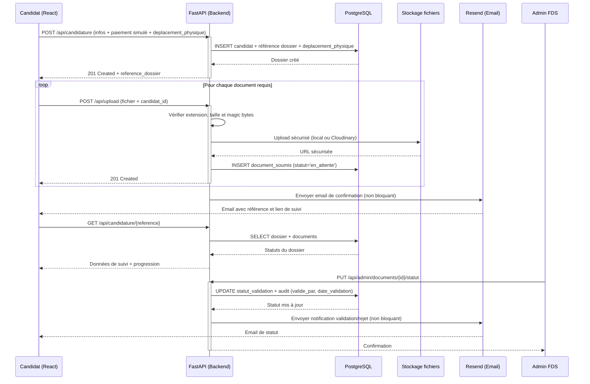
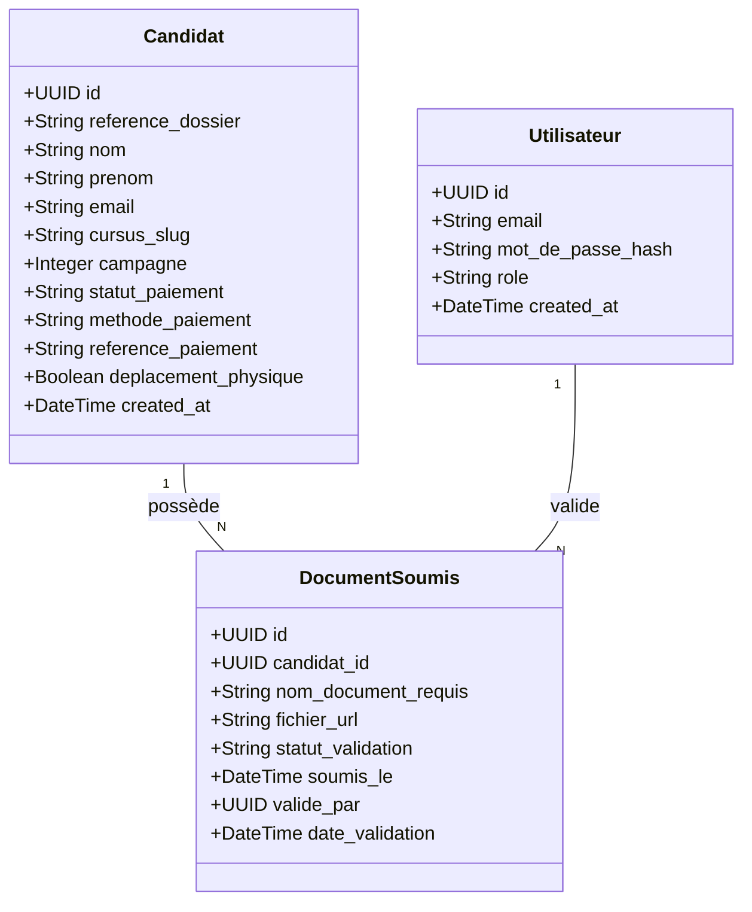
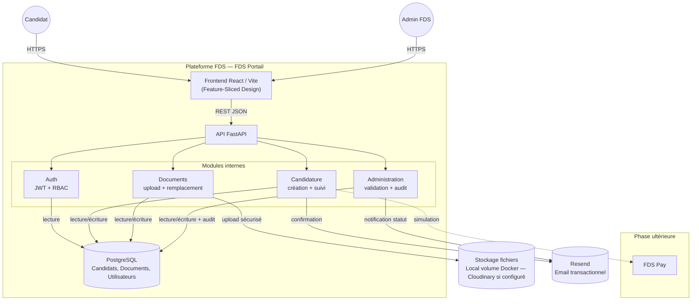

# Cahier des Charges — FDS Portail (Remanié)
**GL-EN3-2026 · Équipe Bravetech · M2 FDS Portail**

> Ce document est le Livrable 1 du Projet 2. Il reprend et corrige le cahier des charges du Projet 1 selon les retours reçus. Le détail technique (ADRs, stack justifiée, NFR chiffrées, plan de tests) se trouve dans `project-docs/` — ce document n'en est que la synthèse orientée décision.

---

## §1. Le problème

La Faculté des Sciences (FDS) de l'UEH forme l'élite de l'ingénierie en Haïti. Pourtant, sa relation avec les futurs étudiants souffre de trois dysfonctionnements structurels :

- **Déficit d'information :** Les informations sur les cursus, les prérequis et les dates circulent via des canaux informels (WhatsApp, bouche-à-oreille). Il n'existe pas de source officielle accessible sur mobile.
- **Friction géographique :** Un candidat hors de Port-au-Prince doit obligatoirement se déplacer physiquement pour obtenir une information fiable ou déposer un dossier papier.
- **Opérations manuelles :** Le secrétariat gère des piles de dossiers physiques, sans traçabilité ni possibilité de suivi pour le candidat.

---

## §2. La solution proposée

**FDS Portail (Module 2)** est la vitrine publique officielle de la FDS et la plateforme dématérialisée d'inscription. Elle transforme le chaos informationnel en certitude pour le candidat : s'informer, postuler et suivre son dossier intégralement en ligne depuis un smartphone.

---

## §3. Le persona

**Louismy, 17 ans**, élève en Terminale à Pétion-Ville. Il possède un smartphone Android avec une connexion 3G intermittente. Il souhaite s'inscrire en génie informatique à la FDS, mais ne trouve pas facilement d'informations officielles sur les dates, les modalités d'admission et les prérequis.

---

## §4. L'interview utilisateur

Afin de valider la réalité du terrain, une interview a été menée auprès d'un profil correspondant au persona principal. La consigne d'ouverture était :

*« Racontez-moi ce que vous avez fait pour trouver des informations sur la FDS et comprendre comment postuler, depuis le moment où vous avez décidé de vous y intéresser jusqu'au moment où vous avez soumis votre candidature ou abandonné l'idée. »*

**Q1 — Première recherche :** J'ai cherché sur Google. J'ai trouvé un ancien site web avec les cursus, mais les informations semblaient peu à jour et difficile à naviguer. Le formulaire de contact ne fonctionnait pas.

**Q2 — Alternative :** J'ai trouvé un numéro de téléphone et j'ai appelé, sans réponse. J'ai compris qu'il fallait me rendre sur place.

**Q3 — Déplacement :** Chaque déplacement comporte une appréhension à cause du contexte sécuritaire. Je me demandais comment une école d'ingénieurs de renom pouvait ne pas avoir de site moderne pour s'inscrire en ligne.

**Q4 — Sur place :** Le secrétariat m'a remis une brochure photocopiée avec des corrections à la main. On m'a demandé de revenir dans deux semaines pour le calendrier.

**Q5 — Candidature :** Je suis revenu quelques semaines plus tard pour remplir un formulaire papier. On m'a confirmé mon admissibilité et communiqué la date du concours.

**Q6 — Suggestions :** Il faudrait un site à jour avec les cursus, les prérequis, les dates et les frais. Et la possibilité de postuler en ligne.

**Verbatims clés :**
> *« J'ai trouvé un ancien site web avec les cursus, mais les informations semblaient peu à jour et le site était difficile à naviguer. »*

> *« Je me demandais comment une école d'ingénieurs de renom pouvait ne pas disposer d'un site moderne avec la possibilité de faire des inscriptions en ligne. »*

---

## §5. Customer Journey Map

| Étape | Actions | Ressenti | Pain Points | Opportunités |
|---|---|---|---|---|
| **1. Recherche** | Cherche « FDS Haïti » sur Google | Perte de temps, doute | Ancien site non mis à jour | Portail officiel centralisé + SEO |
| **2. Contact** | Cherche un numéro, tente d'appeler | Frustration | Aucun canal fiable | Contacts clairs + FAQ |
| **3. Déplacement** 🚨 | Se rend à Delmas 33 | Stress, appréhension | Coûteux, risques sécuritaires | **Candidature 100 % en ligne** |
| **4. Sur place** | Interroge étudiants puis secrétariat | Soulagement temporaire | Brochure papier peu professionnelle | Fiches cursus digitalisées |
| **5. Attente** | Doit revenir pour le calendrier | Agacement | Pas de calendrier en ligne | Dates clés publiées |
| **6. Candidature** 🎯 | Remplit un formulaire papier | Résignation | Procédure lente et manuelle | Formulaire d'upload Mobile-First |
| **7. Confirmation** | Reçoit un numéro d'inscription | Soulagement | Aucun suivi numérique | Référence + suivi en ligne |

**Principal problème identifié :** forte dépendance au déplacement physique, causée par un déficit d'information numérique fiable et centralisée — créant une inégalité d'accès pour les candidats hors de Port-au-Prince.

---

## §6. Job to Be Done

Le Job to Be Done résume la motivation profonde du persona :

> **« Quand je** dois m'inscrire à l'université depuis ma province sans information claire, **je veux** pouvoir m'informer, soumettre mon dossier et payer virtuellement les frais entièrement en ligne **afin de** sécuriser ma candidature à la FDS sans perdre de temps ni risquer ma sécurité dans un déplacement physique. »

---

## §7. L'hypothèse testable

Le JTBD ci-dessus fonde l'hypothèse suivante :

| Élément | Formulation |
|---|---|
| **Nous croyons que** | les lycéens, notamment ceux vivant hors de Port-au-Prince, rencontrent des difficultés importantes pour obtenir des informations fiables et soumettre leur candidature à la FDS. |
| **Ils ont besoin de** | consulter des informations officielles et postuler entièrement en ligne depuis un smartphone. |
| **Afin de** | réduire les déplacements physiques, économiser du temps et améliorer l'accès aux études d'ingénierie. |
| **Nous saurons que cela fonctionne si** | au moins **20 candidatures** sont soumises en ligne durant les deux premières semaines et que **70 % des candidats** complètent le processus sans déplacement physique. |

**Plan de mesure :**

| Indicateur | Méthode | Seuil |
|---|---|---|
| Candidatures soumises | Comptage `candidats.reference_dossier` | ≥ 20 en 14 jours |
| Taux sans déplacement | Question obligatoire `candidats.deplacement_physique` | ≥ 70 % répondent « Non » |
| Taux d'abandon | Comparaison début formulaire / soumissions | ≤ 30 % |
| Temps de soumission | Horodatage début/fin du parcours | ≤ 20 min sur mobile |
| Correction en ligne | Documents passés de `rejete` à `en_attente` | ≥ 80 % des rejets corrigés |

---

## §8. Priorisation MoSCoW

### 🟢 Must Have — Requis pour le MVP

- Pages de présentation des cursus (Informatique, Physique, etc.) et dates clés.
- Formulaire de candidature en ligne avec upload de pièces justificatives (PDF/JPG).
- Génération d'un numéro de référence de dossier (ex : `CAN-2026-X`).
- Suivi du dossier en ligne par le candidat via sa référence.
- Interface sécurisée pour l'administration (changer le statut d'un document).
- Notifications automatiques par email au candidat : confirmation de réception, validation et rejet d'un document (avec lien pour remplacer).
- Possibilité de remplacer un document rejeté depuis la page de suivi.
- Simulation du paiement des frais (MonCash / NatCash) — aucune transaction réelle.
- Question obligatoire `deplacement_physique` pour mesurer l'hypothèse §7.

### 🟡 Should Have — Important

- Notifications push (SMS) en complément de l'email.

### 🔵 Could Have — Souhaitable

- Export CSV/PDF filtré de la liste des dossiers validés, pour les commissions d'admission hors ligne.
- Mode sombre pour l'interface administrative et le formulaire candidat.

### 🔴 Won't Have — Hors périmètre Phase 1

- Transactions monétaires réelles (déléguées au module FDS Pay).
- Plateforme de cours (déléguée à FDS Akademi).

---

## §9. Walking Skeleton

> Louismy ouvre le portail FDS sur son téléphone Android. Il consulte la page du cursus Ingénierie Informatique. Il clique sur « Postuler » et renseigne ses informations personnelles, puis répond à la question obligatoire sur le déplacement physique. Il accède à l'interface de simulation de paiement (MonCash/NatCash) : une fois le paiement virtuel validé, il uploade ses pièces justificatives. Le système lui affiche immédiatement sa référence `CAN-2026-0089` et lui envoie un email de confirmation contenant cette référence et un lien vers la page de suivi.
>
> Plus tard, Louismy retrouve son dossier via la page `/suivi`. Il voit une barre de progression indiquant que son dossier est « En attente de validation ». L'administration valide ou rejette un document — Louismy reçoit immédiatement un email de statut. Si un document est rejeté, la page affiche « Correction requise » et il peut remplacer le document directement depuis cette page.

---

## §10. Use Cases — Diagramme

Ce diagramme présente les interactions entre les deux acteurs : le **candidat** et l'**administrateur FDS**. Le candidat n'a pas besoin de compte pour postuler ; il utilise sa référence pour suivre son dossier. L'administrateur doit obligatoirement s'authentifier avant d'accéder aux dossiers.



> **Les user stories détaillées** de chaque cas d'utilisation vivent dans `project-docs/execution/` — voir [EPIC_EXECUTION.md](project-docs/execution/EPIC_EXECUTION.md) pour la liste complète (US-001 à US-017).

---

## §11. Diagrammes de séquence

Ce diagramme précise la collaboration technique entre le frontend React, le backend FastAPI, la base de données, le service de stockage de fichiers et Resend. Il montre que les emails sont déclenchés par des événements métier et ne sont jamais la source de vérité du dossier.



**Note clé :** si l'envoi d'email échoue, le dossier et ses statuts restent enregistrés en base de données — l'email est une notification, pas la source de vérité.

---

## §12. Modèle de données

### Principes

Le modèle respecte deux principes fondamentaux :

1. **Langage Ubiquitaire (DDD) :** Les noms des entités (`Candidat`, `DocumentSoumis`) reprennent le vocabulaire exact du secrétariat FDS.
2. **Normalisation 3NF :** La distinction entre *ce qui est exigé* (catalogue des pièces, issu du référentiel JSON des cursus) et *ce qui est fourni* (`DocumentSoumis`) évite la redondance.

> **Note :** La liste des documents requis par cursus est gérée via le référentiel JSON officiel des cursus (`JsonCursusRepository`), pas via une table SQL dédiée. `DocumentSoumis` référence la pièce par son nom canonique issu du catalogue JSON.

### 12.1 Diagramme de classes



### 12.2 Contraintes métier

- Chaque dossier possède une référence unique (`CAN-2026-XXXX`).
- Un candidat peut re-candidater d'une année à l'autre — la contrainte d'unicité est `(email, cursus_slug, campagne)`, pas `email` seul.
- Les formats autorisés : PDF, JPG, JPEG. Taille max : 5 Mo.
- Le backend vérifie le type MIME réel (magic bytes) avant enregistrement.
- La soumission nécessite un statut de paiement simulé validé.
- Un document remplacé conserve le même nom logique `nom_document_requis` — son statut repasse à `en_attente`.
- Toute décision admin est auditée (`valide_par`, `date_validation`).
- `deplacement_physique` est obligatoire à la soumission ; les dossiers antérieurs peuvent avoir `NULL`.

### 12.3 Schéma SQL (tables principales)

```sql
CREATE TABLE utilisateurs (
    id UUID PRIMARY KEY DEFAULT gen_random_uuid(),
    email VARCHAR(255) UNIQUE NOT NULL,
    mot_de_passe_hash VARCHAR(255) NOT NULL,
    role VARCHAR(50) DEFAULT 'agent',
    created_at TIMESTAMPTZ DEFAULT CURRENT_TIMESTAMP
);

CREATE TABLE candidats (
    id UUID PRIMARY KEY DEFAULT gen_random_uuid(),
    reference_dossier VARCHAR(20) UNIQUE NOT NULL,
    nom VARCHAR(100) NOT NULL,
    prenom VARCHAR(100) NOT NULL,
    email VARCHAR(255) NOT NULL,
    cursus_slug VARCHAR(100) NOT NULL,
    campagne SMALLINT NOT NULL DEFAULT 2026,
    statut_paiement VARCHAR(50) DEFAULT 'en_attente',
    methode_paiement VARCHAR(50),
    reference_paiement VARCHAR(100),
    deplacement_physique BOOLEAN,
    created_at TIMESTAMPTZ DEFAULT CURRENT_TIMESTAMP,
    UNIQUE (email, cursus_slug, campagne)
);

CREATE TABLE documents_soumis (
    id UUID PRIMARY KEY DEFAULT gen_random_uuid(),
    candidat_id UUID NOT NULL REFERENCES candidats(id) ON DELETE CASCADE,
    nom_document_requis VARCHAR(255) NOT NULL,
    fichier_url VARCHAR(500) NOT NULL,
    statut_validation VARCHAR(50) DEFAULT 'en_attente',
    soumis_le TIMESTAMPTZ DEFAULT CURRENT_TIMESTAMP,
    valide_par UUID REFERENCES utilisateurs(id) ON DELETE SET NULL,
    date_validation TIMESTAMPTZ,
    UNIQUE (candidat_id, nom_document_requis)
);
```

---

## §13. Architecture technique

### Vue d'ensemble

FDS Portail adopte un **Monolithe Modulaire** dont le code interne est organisé en **4 couches (Clean Architecture)** avec une règle absolue : les dépendances ne pointent que vers l'intérieur.

| Couche | Contenu |
|---|---|
| **Domain** (`entities/`) | Entités métier pures — n'importe rien d'externe |
| **Application** (`bll/` + `ports/`) | Use cases et interfaces abstraites |
| **Infrastructure** (`dal/`) | Adaptateurs concrets (SQLAlchemy, stockage, email) |
| **Présentation** (`api/`) | Routers FastAPI, DTOs Pydantic — aucune logique métier |

### Diagramme de composants



**Déploiement :**

| Composant | Cible standard | Bonus FDS (+10 pts) |
|---|---|---|
| Frontend | Vercel | — |
| API | Render / Railway | Serveurs Proxmox FDS |
| Base de données | PostgreSQL managé (Neon / Supabase) | PostgreSQL sur Proxmox |

> Le détail des décisions d'architecture (ADR-001 à ADR-007), la règle de dépendance et les tests d'architecture automatisés sont documentés dans [`project-docs/SOLUTION_DESIGN.md`](project-docs/SOLUTION_DESIGN.md).

---

## §14. Choix technologiques

| Couche | Technologie | Justification |
|---|---|---|
| Frontend | React 19 / Vite / TypeScript | SPA Mobile-First, Feature-Sliced Design, typage fort |
| Backend | FastAPI / Python 3.11+ | Async natif, OpenAPI auto-généré, Pydantic |
| Base de données | PostgreSQL 15 | ACID, intégrité référentielle, index B-Tree |
| ORM | SQLAlchemy 2.x | Requêtes paramétrées (anti-injection) |
| Auth | JWT HS256 + bcrypt | Lib éprouvée, hash sécurisé, RBAC par rôle |
| Stockage fichiers | Volume local Docker (défaut) / Cloudinary (si configuré) | Autonomie sur Proxmox, adaptateur optionnel |
| Email | Resend API — ConsoleEmailSender en dev | Non-bloquant, tolérant aux pannes |
| Déploiement | Vercel + Render/Railway + Neon/Supabase | Offres gratuites, CI/CD depuis GitHub |

> La justification complète de chaque choix (ATAM, analyse des compromis, OWASP, performance 3G, accessibilité WCAG 2.1 AA) est documentée dans [`project-docs/SOLUTION_DESIGN.md`](project-docs/SOLUTION_DESIGN.md) et [`project-docs/NFR.md`](project-docs/NFR.md).

---

*GL-EN3-2026 · Équipe Bravetech — VAILLANT Valcin · DORFILUS Skin-Paolatchi · GUERRIER Joas · LOUIS Widmaken*
